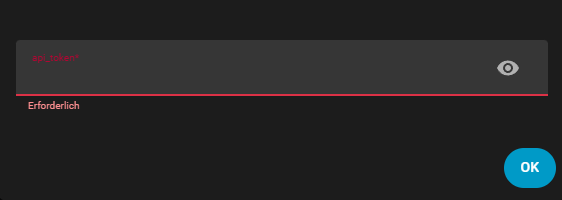
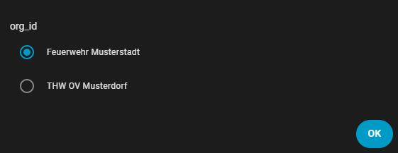
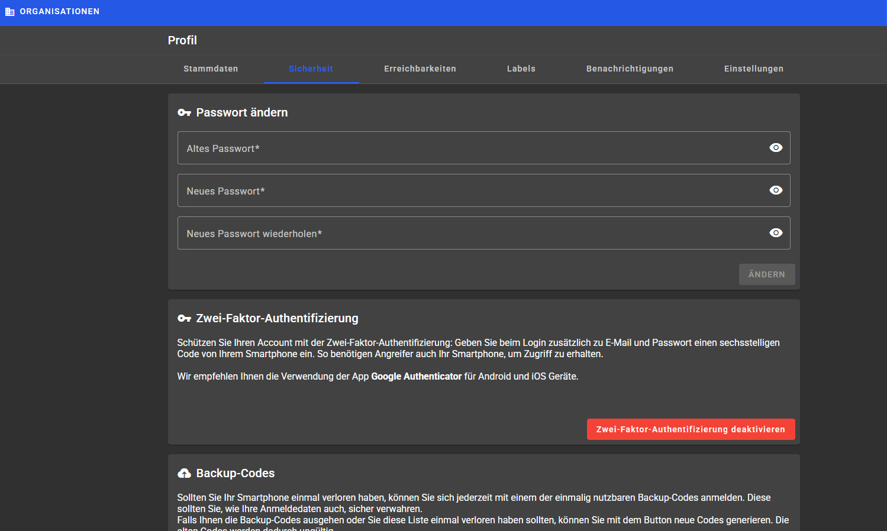
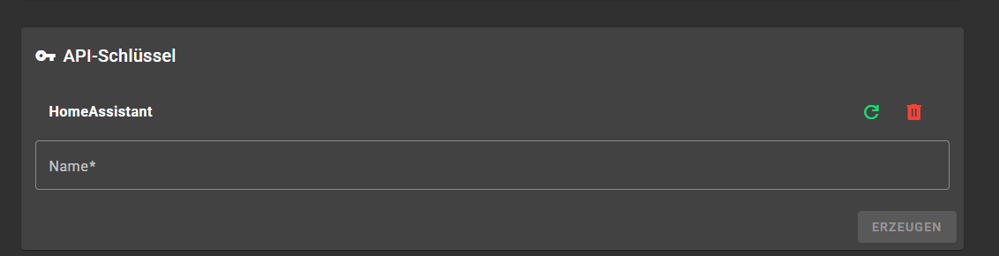

# HA GroupAlarm API

[](https://github.com/hacs/integration)
[](https://github.com/GamingonTour1/ha-groupalarm-api/releases)
[](https://github.com/GamingonTour1/ha-groupalarm-api/stargazers)
[](LICENSE)

Eine Home Assistant Integration für die **GroupAlarm API**, um Alarme, Einsätze und Rückmeldungen direkt in Home Assistant zu integrieren.

[](https://my.home-assistant.io/redirect/hacs_repository/?owner=GamingonTour1&repository=ha-groupalarm-api&category=integration)
---

## ⚡ Features

- 🔔 Abruf von aktuellen GroupAlarm Einsätzen
- 📡 Automatische Aktualisierung via Coordinator (Polling)
- 🧠 Ein zentraler Sensor mit allen Alarmdaten
- 🔁 Binary Sensor für aktiven Alarmstatus
- 🧾 Vollständige Alarmdetails (Message, Event, Feedback, Resources)
- 👤 Unterstützung für Organisationen
- ⚙️ Konfiguration via UI (Config Flow)
- 🚀 HACS kompatibel

---

## ⚙️ Installation

### HACS (empfohlen)

1. HACS → **Integrationen**
2. Menü → **Custom Repository hinzufügen**
3. Repository URL einfügen:

   ```
   https://github.com/GamingonTour1/ha-groupalarm-api
   ```

4. Kategorie: **Integration**
5. Integration installieren
6. Home Assistant neu starten

---

## 🔧 Konfiguration

Nach der Installation:

**Einstellungen → Geräte & Dienste → Integration hinzufügen**

Du benötigst:

- 🔑 API Token (GroupAlarm Personal Access Token)

<p align="center">
  <br>
  <em>API Schlüssel bei der Einrichtung einmalig angeben</em>
</p>

<p align="center">
  <br>
  <em>Organisation auswählen</em>
</p>

## 🔑 API-Token in GroupAlarm erstellen

Für die Einrichtung der Integration benötigst du einen persönlichen API-Token aus der GroupAlarm Web-App.

### 1️⃣ GroupAlarm öffnen und anmelden

Öffne die Web-App und melde dich mit deinem Account an:  
👉 https://app.groupalarm.com

---

### 2️⃣ Profil öffnen

Klicke oben rechts auf dein Profilbild und öffne **Profil**.

<p align="center">
  <br>
  <em>Profil öffnen</em>
</p>

---

### 3️⃣ API-Schlüssel erstellen

1. Wechsle zum Tab **Sicherheit**
2. Scrolle nach unten zum Bereich **API-Schlüssel**
3. Klicke auf **Neuen API-Schlüssel erstellen**
4. Vergib einen Namen (z. B. *Home Assistant*)
5. Kopiere den erzeugten Token

<p align="center">
  <br>
  <em>API-Schlüssel erstellen</em>
</p>

⚠️ **Wichtig:** Der Token wird nur einmal angezeigt. Speichere ihn sofort.

---

## 📊 Entitäten

### Sensor

| Entity                     | Beschreibung |
|----------------------------|-------------|
| `sensor.NAME_latest_alarm` | Hauptsensor mit allen Alarmdaten |

**Attribute enthalten:**
- message
- event
- creator
- start/end time
- alarmResources
- optionalContent
- feedback

---

### Binary Sensor

| Entity                      | Beschreibung |
|-----------------------------|-------------|
| `binary_sensor.NAME_active` | Zeigt ob aktuell ein Alarm aktiv ist |

---

## 🔐 Sicherheit

API Token wird lokal in Home Assistant gespeichert und nicht extern übertragen.

---

## 📄 License

**Proprietary – All rights reserved.**
