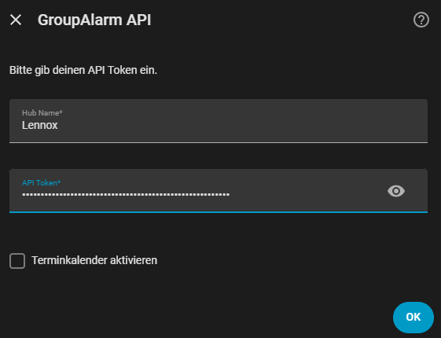
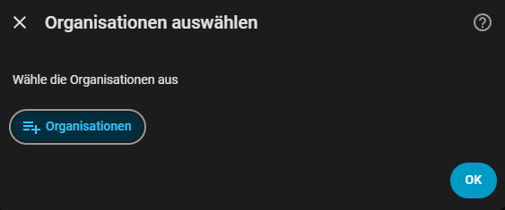
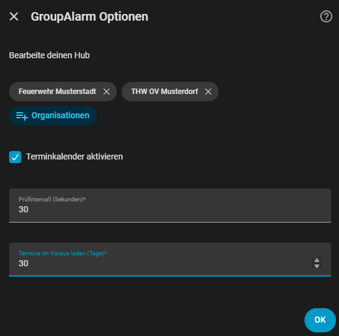
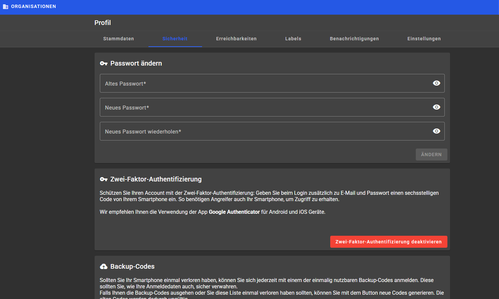
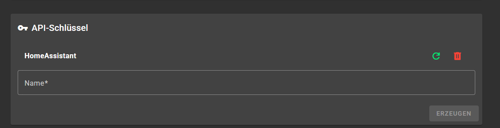

# HA GroupAlarm API

Eine Home Assistant Integration für die **GroupAlarm API**, um Alarme, Einsätze, Termine und Rückmeldungen direkt in Home Assistant zu integrieren.

--- 
## 🌍 Languages

- 🇩🇪 Deutsch
- 🇬🇧 English (README coming soon...)
- 🇫🇷 Français (README coming soon...)

---

## ⚡ Features

- 🔔 Abruf von aktuellen GroupAlarm Einsätzen (Alarme)
- 📅 Kalender-Integration für Termine (optional aktivierbar)
- 📡 Automatische Aktualisierung via DataUpdateCoordinator (Polling)
- 🧠 Zentrale Verarbeitung aller Organisationsdaten
- 🔁 Binary Sensor für aktiven Alarmstatus
- 🧾 Vollständige Alarmdetails (Message, Event, Feedback, Resources)
- 👤 Unterstützung mehrerer Organisationen
- ⚙️ Konfiguration via UI (Config Flow + Options Flow)
- ⏱️ Einstellbarer Scan-Intervall (Polling Rate)
- 📆 Einstellbare Termin-Vorschau (Lookahead Days)
- 🚀 HACS kompatibel

---

## ⚙️ Installation

### HACS (empfohlen)

1. HACS → **Integrationen**
2. Menü → **Custom Repository hinzufügen**
3. Repository URL einfügen: https://github.com/GamingonTour1/ha-groupalarm-api
4. Kategorie: **Integration**
5. Integration installieren
6. Home Assistant neu starten

---

## 🔧 Konfiguration

Nach der Installation:

**Einstellungen → Geräte & Dienste → Integration hinzufügen**

Du benötigst:

- 🔑 API Token (GroupAlarm Personal Access Token)
- 🏢 Mitglied einer Organisation in GroupAlarm

1. Lege einen beliebigen Namen fest und füge deinen API Token ein. Falls du deinen Terminkalender von GroupAlarm in Homeassistant integrieren möchtest, dann kannst du ihn unten mit der Checkbox aktivieren.

   
  <em>Einrichtung Schritt 1</em>

2. Wähle die Organisationen aus, welche du in GroupAlarm integrieren möchtest

   
  <em>Einrichtung Schritt 2</em>

3. Fertig! :D

---

## ⚙️ Optionen (nachträglich änderbar)

Nach der Einrichtung kannst du die Integration jederzeit über  
**„Gerät → Konfigurieren“** anpassen.

### Verfügbare Optionen:

- 🏢 Organisationen hinzufügen/entfernen
- 📅 Kalender aktivieren/deaktivieren
- ⏱️ Scan Intervall (Polling) ändern
- 📆 Termin-Vorschau (Lookahead Tage) ändern

   
  <em>Verfügbare Optionen</em>

⚠️ Änderungen werden automatisch übernommen (kein Neustart notwendig).

---

## 🔑 API-Token in GroupAlarm erstellen

### 1️⃣ GroupAlarm öffnen und anmelden
👉 https://app.groupalarm.com

### 2️⃣ Profil öffnen
Profilbild → **Profil**

   
  <em>Profil öffnen</em>

### 3️⃣ API-Schlüssel erstellen
- Tab **Sicherheit**
- API-Schlüssel erstellen

   
  <em>API-Schlüssel erstellen</em>

- Namen vergeben (z. B. Home Assistant)
- Token kopieren

⚠️ Der Token wird nur einmal angezeigt.

---

## 📊 Entitäten

### 🧠 Sensor

| Entity                        | Beschreibung |
|-------------------------------|-------------|
| `sensor.ORGNAME_latest_alarm` | Hauptsensor mit Alarmdaten |

**Attribute:**
- message
- event
- creator
- start/endDate
- alarmResources
- optionalContent
- feedback

---

### 🔁 Binary Sensor

| Entity                         | Beschreibung |
|--------------------------------|-------------|
| `binary_sensor.ORGNAME_active` | Zeigt ob aktuell ein Alarm aktiv ist |

---

### 📅 Kalender (optional)

| Entity             | Beschreibung |
|--------------------|-------------|
| `calendar.ORGNAME` | Termine der Organisation |

---

## ⚙️ Performance & Polling

Die Integration nutzt einen zentralen Coordinator:

- Standard Scan Intervall: **30 Sekunden (konfigurierbar)**
- API Lookahead für Termine: **30 Tage (konfigurierbar)**
- Effiziente Bündelung aller API Requests

---

## 🔐 Sicherheit

API Token wird lokal in Home Assistant gespeichert und nicht extern übertragen.

---

## 📄 License

**Proprietary – All rights reserved.**